# Linux

>## 一、常用

---

	0、dos2unix demo.sh
	解决sh文件格式不正确的问题
	1、安装rpm包
	sudo rpm -ivh lsof-4.87-4.el7.src.rpm 
	2、查看操作系统
	cat /etc/redhat-release 
	3、查看进程文件占用数
	lsof  -p 118951   |   wc  -l
	4、关闭防火墙
	firewall-cmd --zone=public --add-port=80/tcp --permanent
	5、防火墙重启
	service firewalld restart
	6、查看磁盘信息
	df -h /etc
	7、查看文件大小
	du

---

>## 二、linux安装vsftpd服务器--以及使用匿名登录指定文件的上传下载

---

	# 安装vsftpd
	yum install vsftpd

	# ----------------------修改配置文件-------------------------
	vi /etc/vsftpd/vsftpd.conf

	# 修改匿名登录可以上传以及写文件
	anon_upload_enable=YES
	anon_mkdir_write_enable=YES

	# 在最后添加如下配置

	# 修改不只读
	anon_world_readable_only=NO
	# 可以重命名之类的
	anon_other_write_enable=YES
	# 修改匿名登录根目录
	anon_root=/root/ftp

	#退出保存登录
	# ----------------------修改配置文件结束-------------------------

	# ----------------------创建上传文件夹-------------------------
	# 匿名登录的主文件夹不能为777权限，所以需要在主文件夹下面创建一个上传文件夹

	# 创建文件夹
	cd
	mkdir ftp
	#去除用户根目录的写权限
	chmod a-w ftp

	cd ftp
	mkdir Main

	# 修改权限
	# 因为vsftpd.conf配置的umask为022，所以777的文件夹的实际权限也只有755
	chmod 777 Main/
	# 修改所有者
	chown ftp:ftp Main/
	# ----------------------创建上传文件夹结束-------------------------

	# ----------------------这个时候，一般的就可以使用，但是还是有些不能上传的,一般是因为selinux启用了-------------------------
	# 修改规则
	setsebool -P allow_ftpd_anon_write=1 allow_ftpd_full_access=1
	# 查询修改的配置
	getsebool -a|grep ftpd

	# ----------------------这个时候，一般的就可以使用，但是还是有些不能上传的结束-------------------------
	# 重启服务器
	service vsftpd restart

---

>## 三、鸟哥私房菜

---

>### 1、线上求组

	1、命令帮助
		netstat --help
	2、命令描述
		man netstat
	3、谁在线
		who

>### 2、权限以及文件操作

	1、权限对应数字
		r-4,w-2,x-1
	2、权限类别
		User:用户
		Group：用户组
		Other:其他用户
	3、目录代表
		.代表此层目录
		..代表上一层目录
		-代表前一个工作目录
		~代表“目前使用者身份”所在的主文件夹
		~account代表account这个使用者的主文件夹（account是个帐号名称）
		
		注意：
		xxx这个使用者的主文件夹是/home/xxx/
		特殊：root用户主文件夹是/root/
	4、文本查看命令
		cat	由第一行开始显示文件内容
		tac	从最后一行开始显示，可以看出tac是cat的倒着写！
		nl	显示的时候，顺道输出行号！
		more	一页一页的显示文件内容
		less	与more类似，但是比more更好的是，他可以往前翻页！
		head	只看头几行
		tail	只看尾巴几行
		od	以二进制的方式读取文件内容！
	5、文件列表查看
		ls -l

		正规文件：-
		目录（directory）：d
		链接文件（link）：l
		数据接口文件（sockets）：s
		数据输送档（FIFO,pipe）：p
		设备与设备文件（device）：	
			1、区块（block）设备文件：就是一些储存数据，以提供系统随机存取的周边设备，举例来说，硬盘与软盘等就是啦！你可以随机的在硬盘的不同区块读写，这种设备就是区块设备啰！你可以自行查一下/dev/sda看看，会发现第一个属性为[b]喔！
			2、字符（character）设备文件：亦即是一些序列埠的周边设备，例如键盘、鼠标等等！这些设备的特色就是“一次性读取”的，不能够截断输出。举例来说，你不可能让鼠标“跳到”另一个画面，而是“连续性滑动”到另一个地方啊！第一个属性为[c]。
	6、more指令介绍
		功能介绍：可以一页页的打开文本。
		在more这个程序的运行过程中，你有几个按键可以按的：
			1、空白键：代表向下翻一页；
			2、Enter：代表向下翻“一行”；
			3、/字串：代表在这个显示的内容当中，向下搜寻“字串”这个关键字；
			4、:f：立刻显示出文件名以及目前显示的行数；
			5、q：代表立刻离开more，不再显示该文件内容。
			6、b或[ctrl]-b：代表往回翻页，不过这动作只对文件有用，对管线无用。
	7、less指令介绍
		功能介绍：可以一页页的打开文本。les的用法比起more又更加的有弹性。
			1、空白键：向下翻动一页；
			2、[pagedown]：向下翻动一页；
			3、[pageup]：向上翻动一页；
			4、/字串：向下搜寻“字串”的功能；
			5、?字串：向上搜寻“字串”的功能；
			6、n：重复前一个搜寻（与/或?有关！）
			7、N：反向的重复前一个搜寻（与/或?有关！）
			8、g：前进到这个数据的第一行去；
			9、G：前进到这个数据的最后一行去（注意大小写）；
			10、q：离开less这个程序；
	8、以asc编码打开2进制文件
		od -t c nohup.out 
	9、掩码
		umask 022
		要注意的是，umask的分数指的是“该默认值需要减掉的权限！”而不是减具体的数值!!!
		因为r、w、x分别是4、2、1分，所以啰！也就是说，当要拿掉能写的权限，就是输入2分，而如果要拿掉能读的权限，也就是4分，那么要拿掉读与写的权限，也就是6分，而要拿掉执行与写入的权限，也就是3分，这样了解吗？请问你，5分是什么？呵呵！就是读与执行的权限啦！
	10、寻找命令可执行文件位置
		which -a ifconfig
	11、搜寻文件
		whereis：搜索关键位置的文件
		locate:搜索数据库保存的文件信息（一天一更新，可用updatedb命令直接更新）
		find /root -name '*temp*':查询磁盘
	12、列出搜索文件夹的详情
		ls -ld $(locate crontab)	
	13、对比文件
		diff file1 file2
	
>### 3、文件打包

	压　缩：tar -Jcv -f filename.tar.xz 要被压缩的文件或目录名称
	查　询：tar -Jtv  -f filename.tar.xz
	解压缩：tar -Jxv -f filename.tar.xz -C 欲解压缩的目录

>### 4、Vi

	常用命令：
	[Page Down] ：屏幕“向下”移动一页。
	[Page Up]：屏幕“向上”移动一页。
	功能键[Home]：移动到这一列的最前面字符处。
	功能键[End]： 移动到这一列的最后面字符处。
	G：移动到这个文件的最后一列
	gg：移动到这个文件的第一列。
	n<Enter>：n为数字。光标向下移动n列。
	/word：向下搜索单词。
	?word：向上搜索单词。
	n/N：表示继续向下或者向上搜索。
	dd:删除光标所在的那一整列。
	d0：删除光标所在处，到该列的最前面一个字符。
	yy：复制光标所在的那一列。
	y0：复制光标所在的那个字符到该列行首的所有数据。
	:w：写入。
	:q：离开。
	:q!：强制离开，不保存。
	
>### 5、shell

	1、查看命令类型
		type apt
	2、换行输入
		\
	3、查看环境变量
		env
	4、提示符设置
		PS1='[\u \t \w]\$'
		\d：可显示出“星期 月 日”的日期格式，如："Mon Feb 2"
		\H：完整的主机名称。举例来说，鸟哥的练习机为“study.centos.vbird”
		\h：仅取主机名称在第一个小数点之前的名字，如鸟哥主机则为“study”后面省略
		\t：显示时间，为24小时格式的“HH:MM:SS”
		\T：显示时间，为12小时格式的“HH:MM:SS”
		\A：显示时间，为24小时格式的“HH:MM”
		\@：显示时间，为12小时格式的“am/pm”样式
		\u：目前使用者的帐号名称，如“dmtsai”；
		\v：BASH的版本信息，如鸟哥的测试主机版本为	4.2.46（1）-release，仅取“4.2”显示
		\w：完整的工作目录名称，由根目录写起的目录名称。但主文件夹会以~取代；
		\W：利用basename函数取得工作目录名称，所以仅会列出最后一个目录名。
		#：下达的第几个指令。
		$：提示字符，如果是root时，提示字符为#，否则就是$啰～
	5、?
		?变量,指上一个执行命令的回传值。
		echo $?
	6、给整个环境添加变量
		vi ~/.bashrc：打开bash环境变量
		test=hello：设置tett变量
		source  ~/.bashrc：应用变量
	7、输入变量
		read -p 'pls input name:' name
	8、声明变量
		1、可以直接设置变量，这样就是字符串类型：name=xq
		2、声明变量：declare -i num=100+1
			declare	[-aixr]	variable
			选项与参数：
			-a：将后面名为variable的变量定义成为阵列（array）类型
			-i：将后面名为variable的变量定义成为整数数字（integer）类型
			-x：用法与export一样，就是将后面的variable变成环境变量；
			-r：将变量设置成为readonly类型，该变量不可被更改内容，也不能unset。	
	9、读取变量
		建议都用${name}方式来读取变量。因为数组只能通过这个方式读取。
	10、给自定义命令取别名
		alias lm='ls -al'
	11、历史输入命令
		history
			1、使用!!执行上一个命令。
			2、“!vi”来执行最近指令开头是vi的命令行！
			3、用!+数字 执行命令。
	12、输入到文件
		ll> file：覆盖写入
		ll>>file:追加写入
		ls sdsa 2>  d:错误信息覆盖写入
		ls sdsa 2> > d：错误信息追加写入
		ls sdsa 1>>right.log 2>err.log：将错误信息和正确信息输出到两个文件
		ls sdsa >>all.log 2>&1：将错误信息和正确信息输出到一个文件
	13、文件输出到命令
		cat >file2 <file1:从file1中读取数据，输入到file2。
	14、login shell

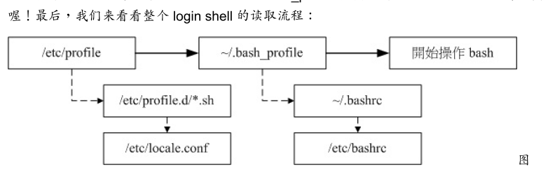

	15、万用字符
		ls -d [t]*

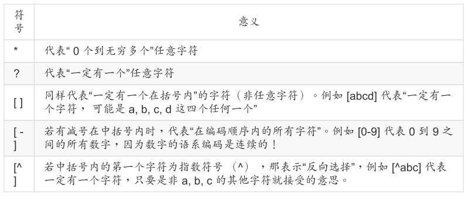

	16、特殊符号

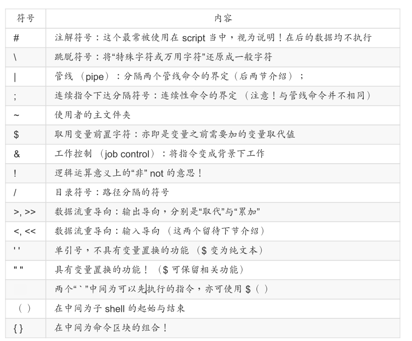

	17、命令执行

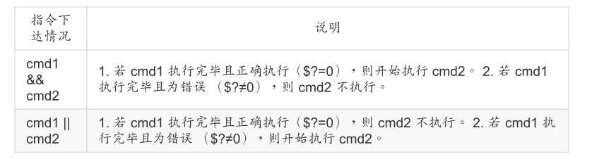

>### 6、其他

	1、程序树
		pstree
	2、查看程序状态
		top
		P:按cpu占用排序

---

>## 四、linux目录解析

---

>### 1、概要

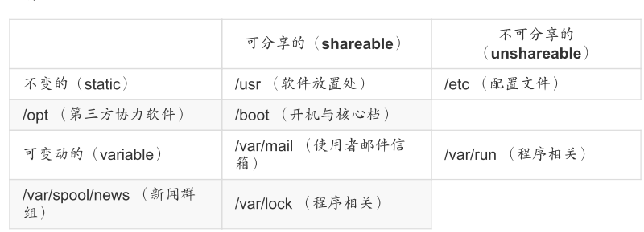

>### 2、主目录

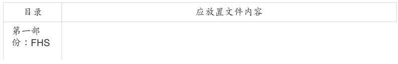
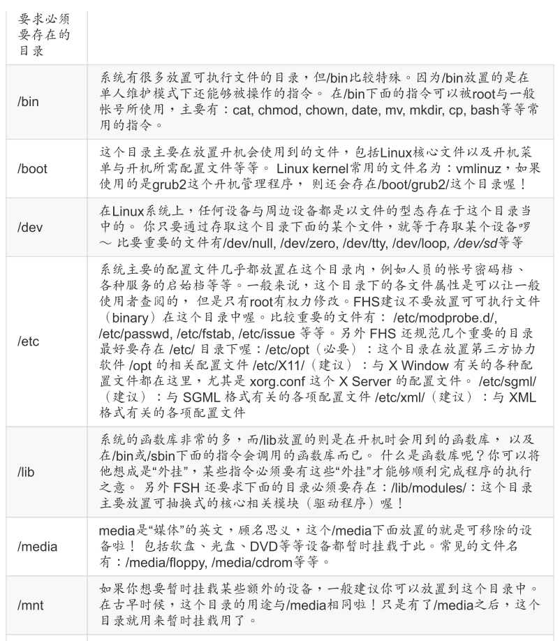
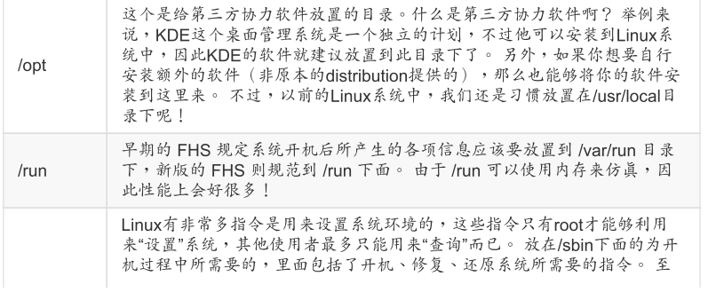
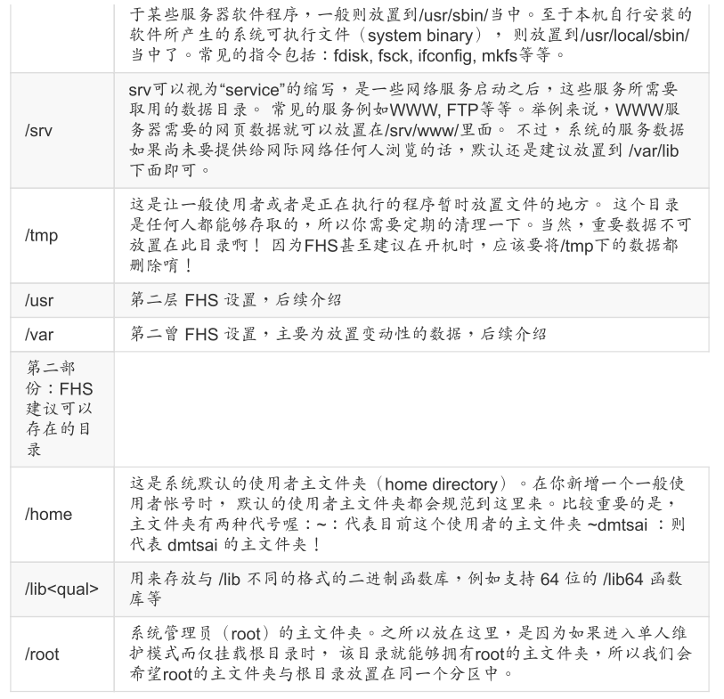

>### 3、/usr很多读者都会误会/usr为user的缩写，其实usr是Unix Software Resource的缩写，也就是“Unix操作系统软件资源”所放置的目录。

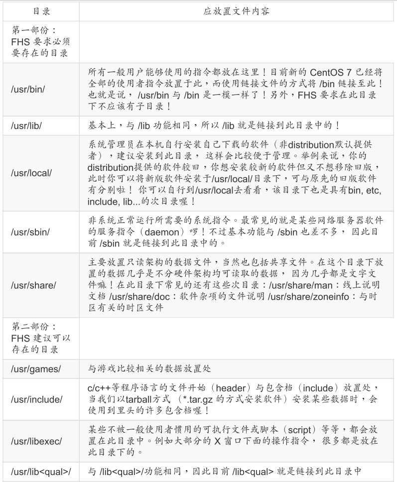
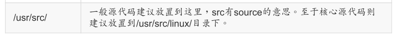

>### 4、/var

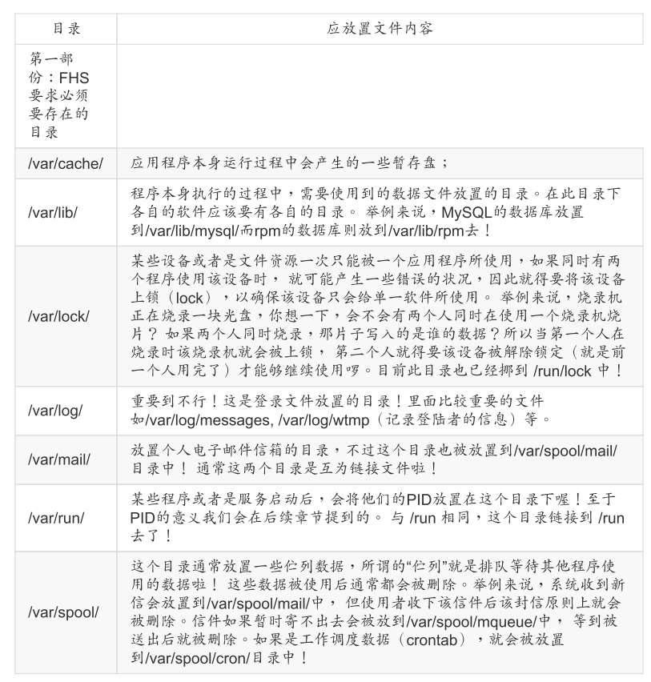

>### 5、再汇总

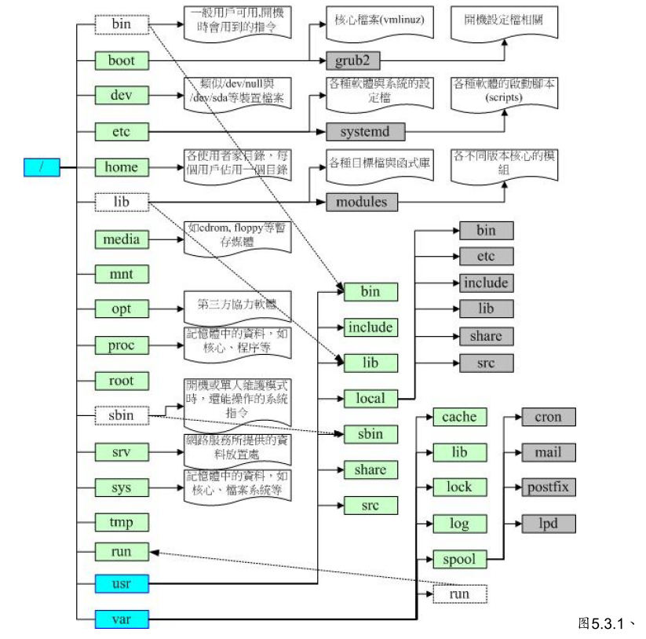

---