# 非暴力沟通

--- 

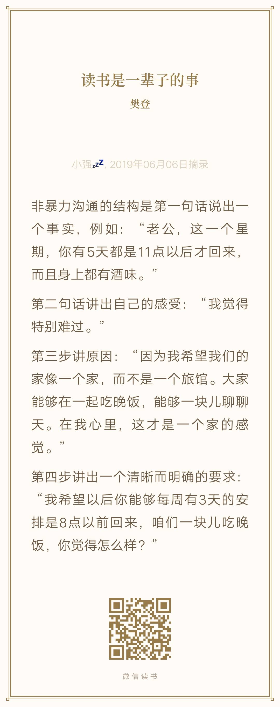

---

> ## 第一章 让爱融入生活

--- 

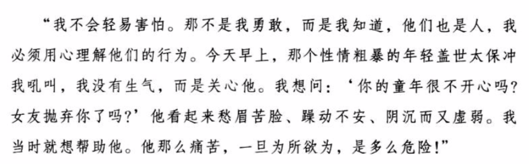

---

> ## 第二章 是什么蒙蔽了爱

--- 

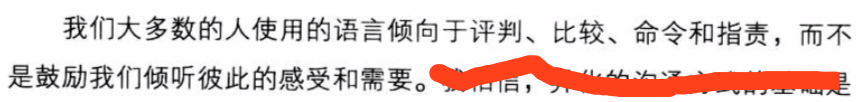

---

> ## 第三章 区分观察和评论

--- 

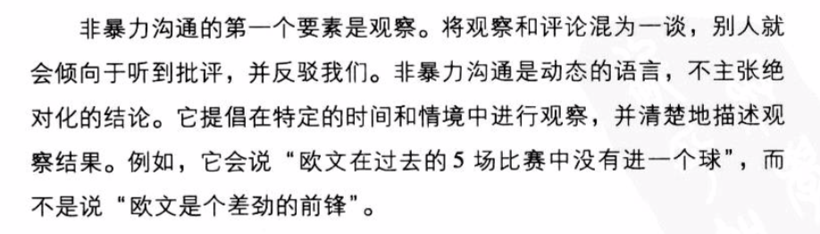

---

> ## 第四章 体会和表达感受

--- 

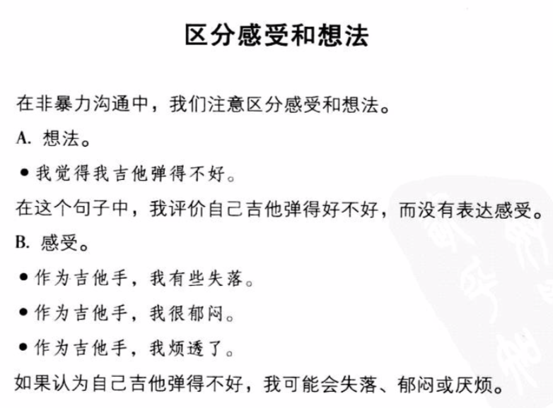

---

> ## 第五章 感受的根源

--- 

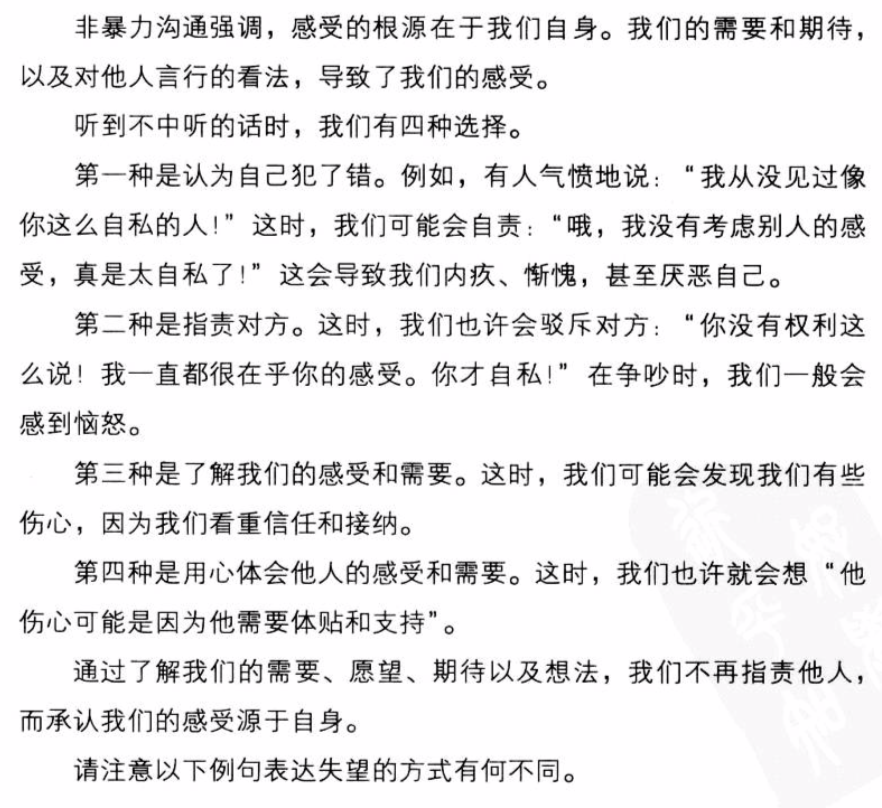
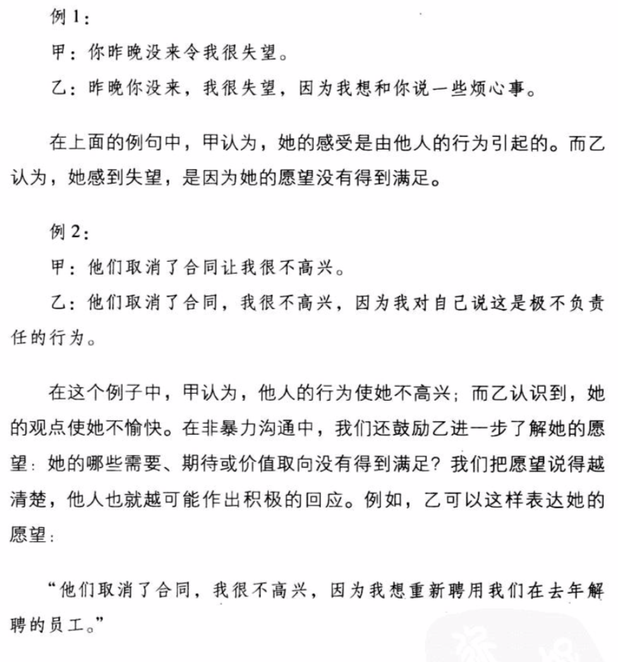
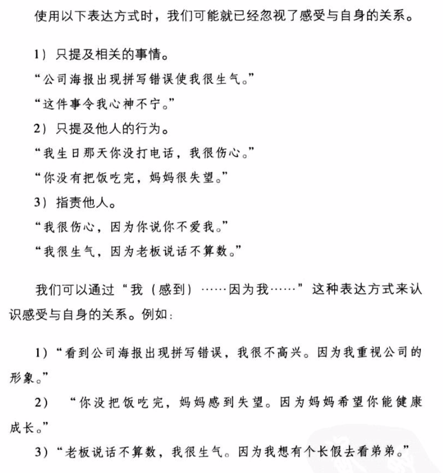

>_在听到不中听的话时，我们要准确明确的表达自己的感受或需求！_
    
---

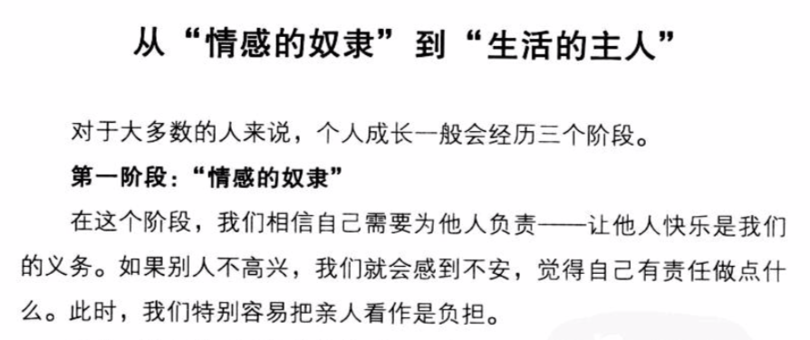
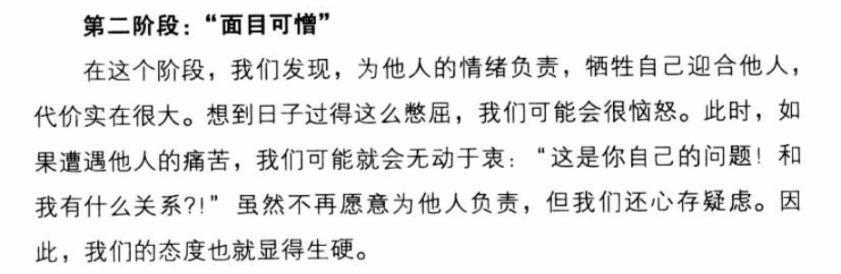
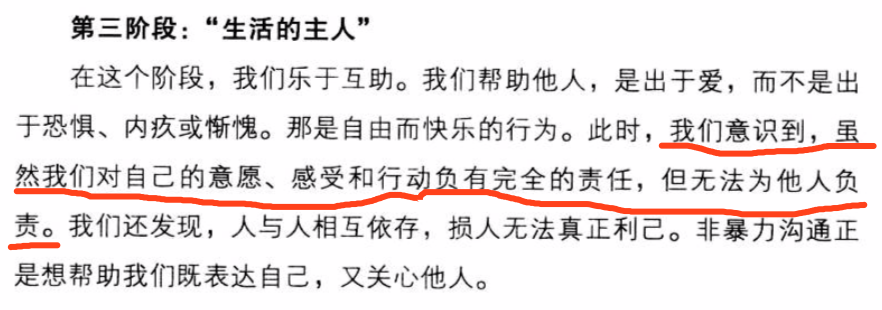

---

> ## 第六章 请求帮助

---

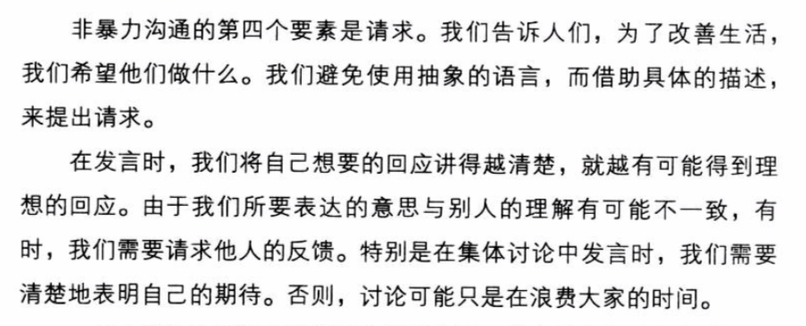

>_非暴力沟通四个要素：观察，感受，表达需求，提出请求_

---

> ## 第七章 用全身心倾听

---

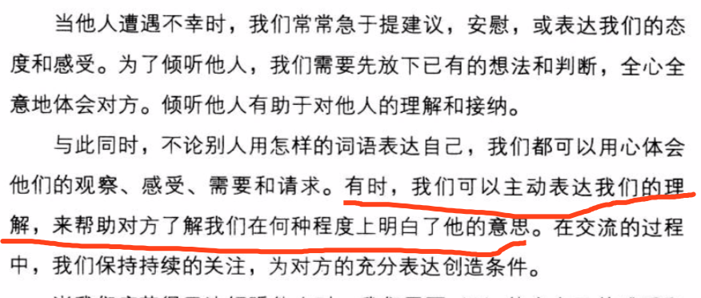

---

> ## 第八章 倾听的力量

> ## 第九章 爱自己

---

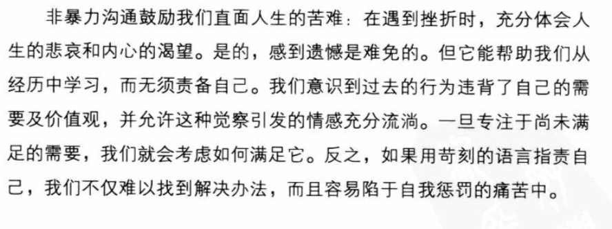

---

> ## 第十章 充分表达愤怒

---

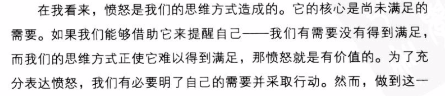
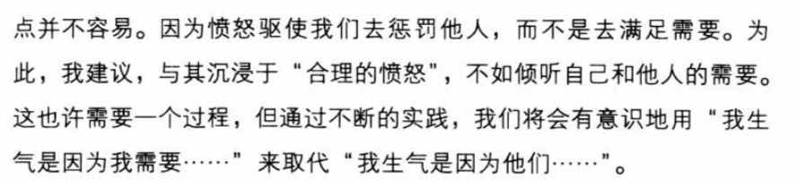

---

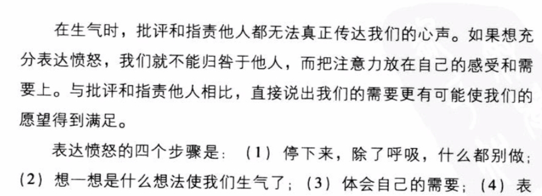
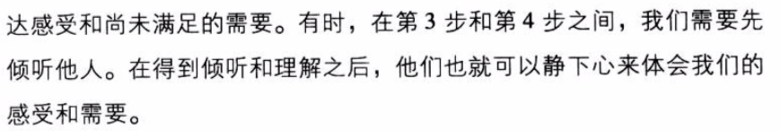

>_听到和自己观念相驳的言论，抑制下意识的反驳，转而倾听和引导对面的谈话。_

---

> ## 第十一章 运用强制力避免伤害

---

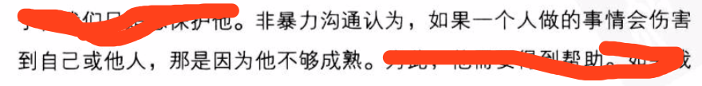

---

> ## 第十二章 重获生活的热情

> ## 第十三章 表达感激

---

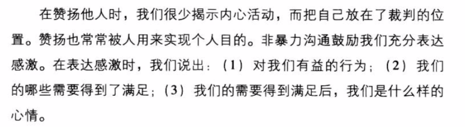

---