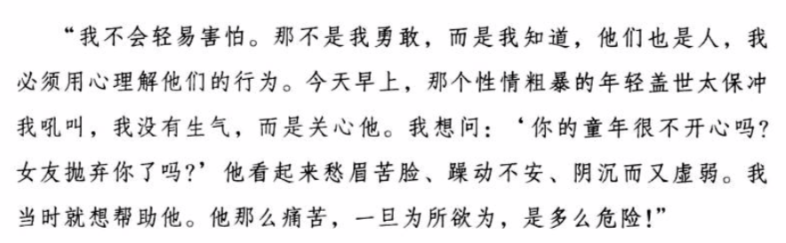
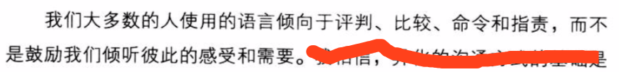
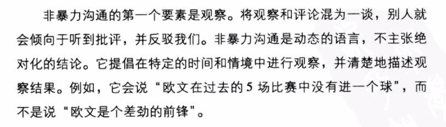
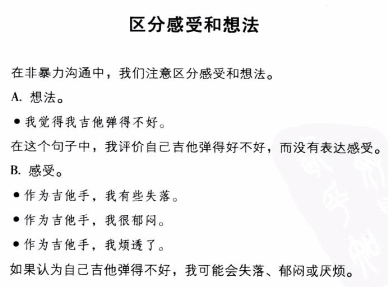
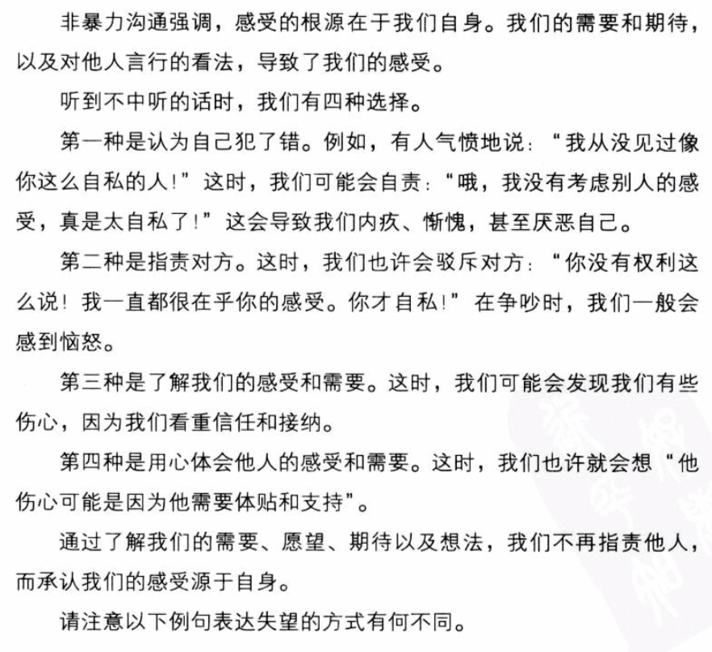
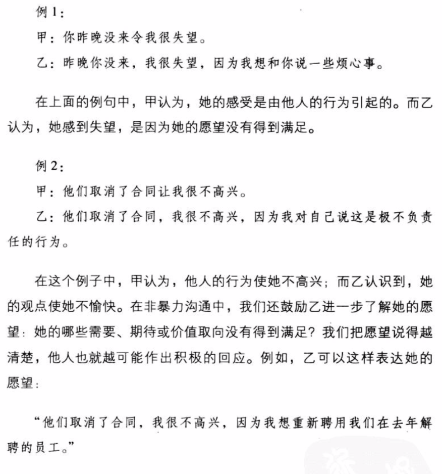
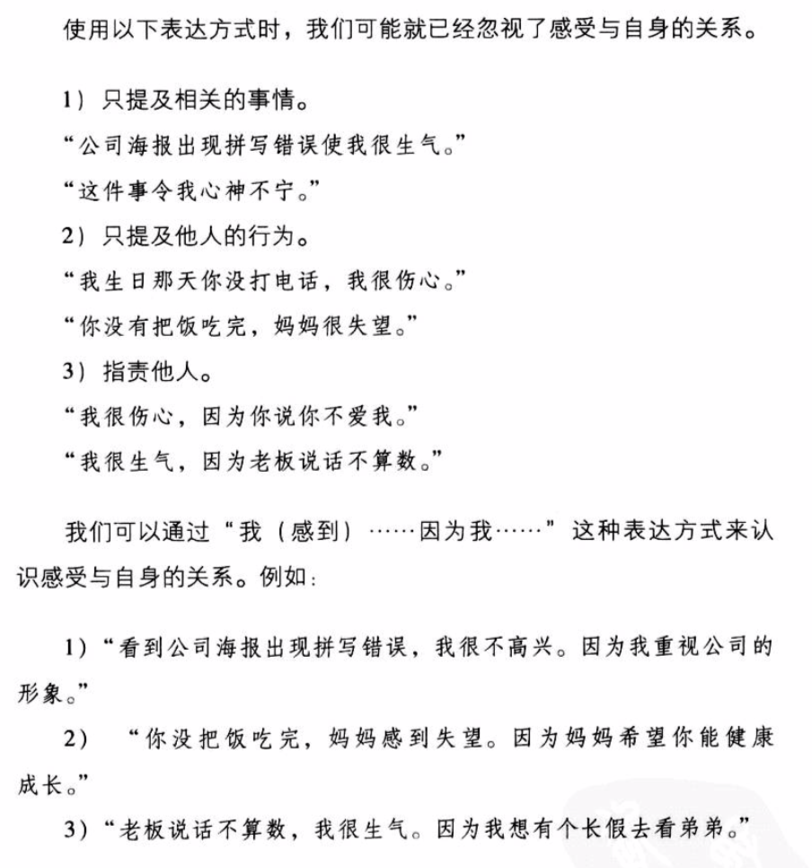
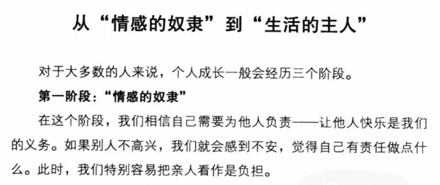
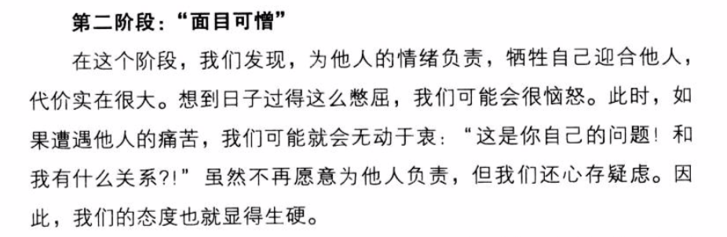
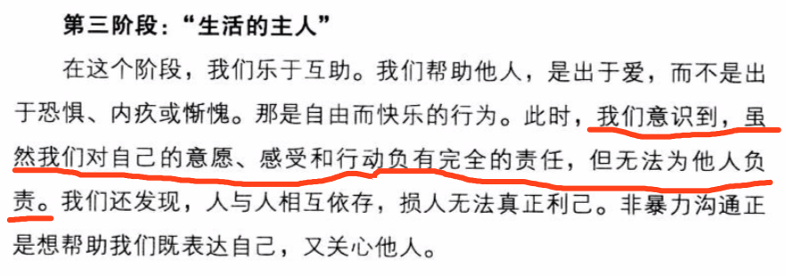

# 非暴力沟通

> ## 第一章 让爱融入生活

--- 

---

> ## 第二章 是什么蒙蔽了爱

--- 

---

> ## 第三章 区分观察和评论

--- 

---

> ## 第四章 体会和表达感受

--- 

---

> ## 第五章 感受的根源

--- 

>_在听到不中听的话时，我们要准确明确的表达自己的感受或需求！_
    
---

---

> ## 第六章 请求帮助